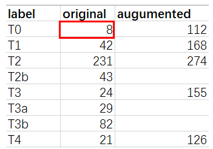
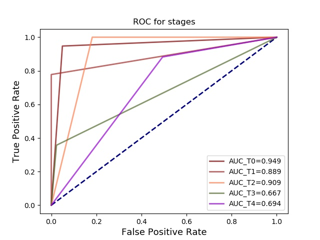
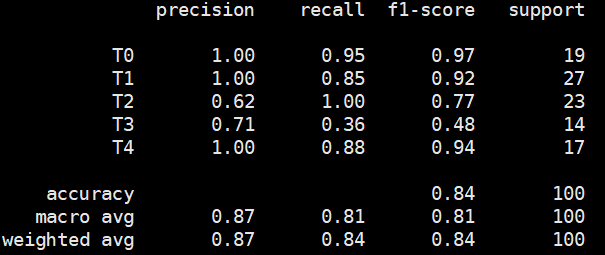

# Bladder-Cancer-Stage-Detection
## Faster-RCNN Bladder Detection
Detect bladder and subtract the bladder window (this code is updating)
## Dataset
CT/MRI images are collected from TCIA-BLCA (The Cancer Imaging Archive), you can download original data from:
https://wiki.cancerimagingarchive.net/display/Public/TCGA-BLCA

These data include:
- CT/MRI Series
- CSV files regarding patient status and staging info where patientID is an important key I use for naming preprocessing images. 
Besides, I upload detect-and-crop bladder images here:
BaiduNetdisk Link：
https://pan.baidu.com/s/18VrdVupcTqqy6cG--Lmp4g 

Captcha Code ：48pi 

## Usage
You can try download the cropped image first, and try to run code from **dcgan** folder for T0/T1/T4 images, except that u need small changes to paths variables. 

## DCGAN sampler
First, I choose useful slices from an CT serie where bladder is presented. But then I found some class dataset are insufficient. There are only 8 sample from T0! So I generated GAN samples for T0, T1 and T4, and merge sub-classes for T2 and T3 in order to balance the dataset, here's the comparison between original and generated dataset sub-classes samples count:

## Resnet50
Classify stages of bladder cancer
## Evaluation
ROC and AUC of individual class are calculated, beside recall, precision and F1 showed as report

